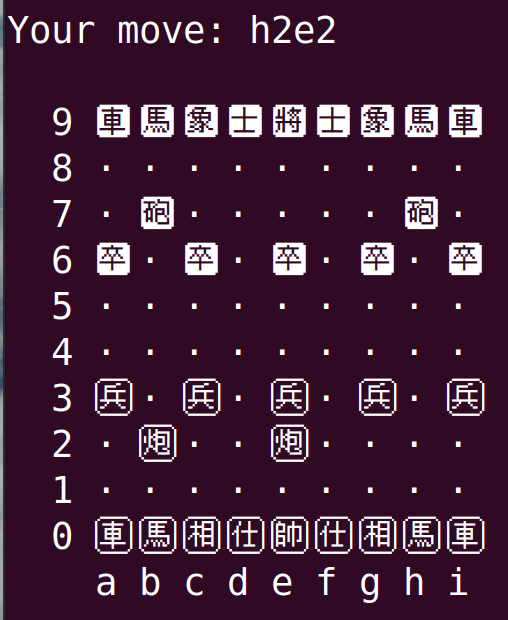
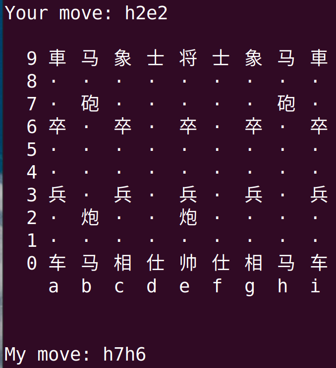
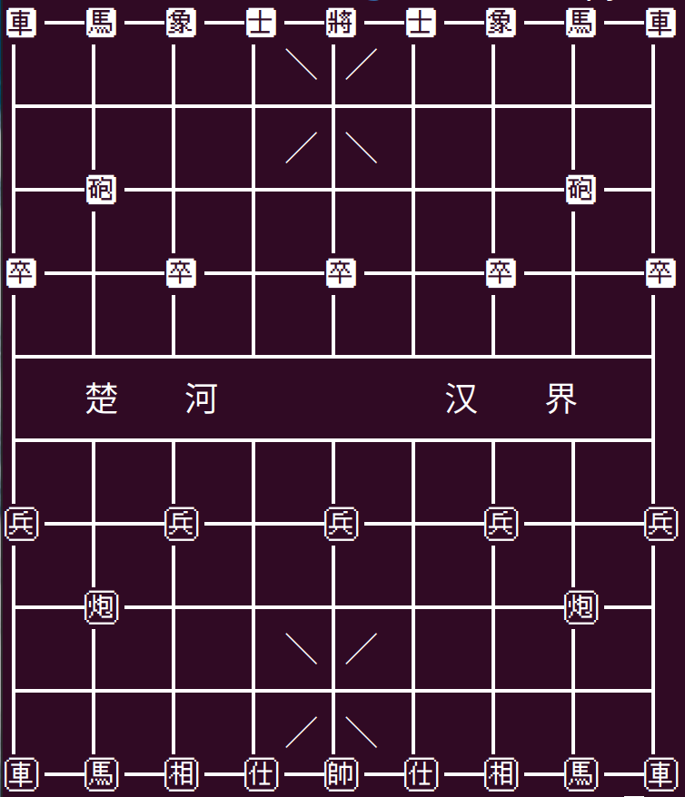
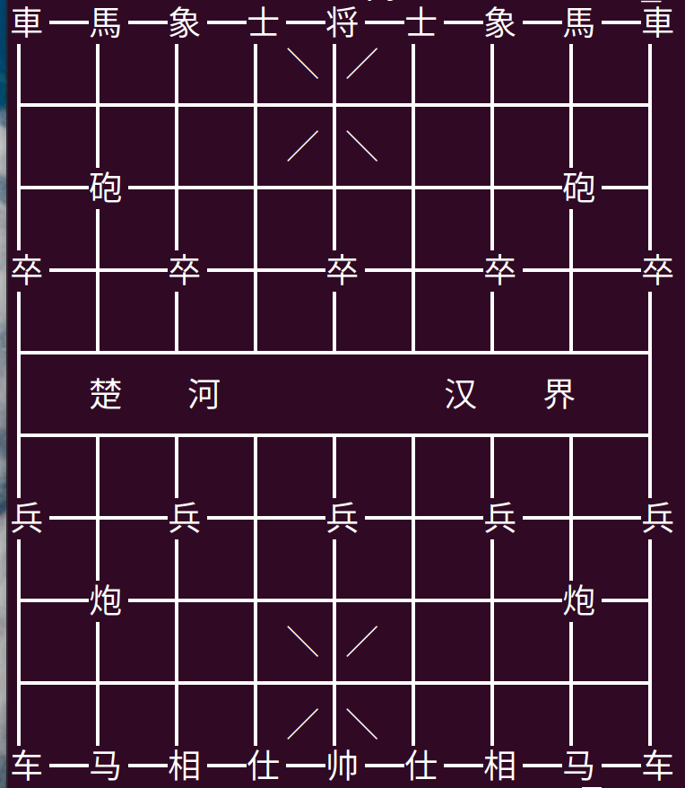

# 中国象棋 Python | Chinese Chess Python

## 特性
- 代码简洁：仅仅使用一百多行代码即实现了中国象棋，并具有简单对战功能。
- 性能高效：经测试水平在初学者之上。
- 使用传统象棋表示方法来表示棋子移动。

## 缺点
- 现代竞技象棋有许多复杂的规则，例如不得长将，长吃等，参见[2011版象棋规则](http://www.xqbase.com/protocol/rule2011.pdf)。本程序仅实现了基本规则，未实现禁手。
- 没有引入随机参数，导致在相同局面下程序总是会有相同的输出。

## 注意
- 本程序使用的象棋棋子来自Unicode13中的[棋类符号](https://www.unicode.org/charts/PDF/U1FA00.pdf)，如果你的电脑能正确显示以下几个字符：🩠 🩡 🩢 🩣 🩤 🩦 🩥 🩧 🩨 🩩 🩪 🩫 🩭 🩬，则可以最大程度上利用本程序，否则请在运行程序时设定棋子编码参数`p/piece`为`chinese`，即`python sunfish_chinese.py -p chinese`或`python sunfish_chinese.py --piece chinese`。
- 因为字体关系，有些字体中文字符长度不等于两个英文字符长度，所以显示的棋盘可能没有对其，可以通过设定宽度参数`w/width`来进行调节，即`python sunfish_chinese.py -w 2`或`python sunfish_chinese.py --width 2`。
- 测试运行环境为Ubuntu20.04，使用系统terminal，字体为Monospace Regular。

## 运行截图



如果添加设置参数`--pieces chinese`



# 运行程序
```shell
python sunfish_chinese.py -p unicode -w 1
```

## 棋盘显示
本仓库代码还实现了中文棋盘显示，运行`python chinese_chess_board.py`即可。同样，如果字体不支持Unicode13， 可修改`chinese_chess_board.py`第一行为`def chinese_chess(mode=''):`。效果如下所示：

如果字体支持Unicode13



如果不支持Unicode13



## 参考资料
`sunfish_chinese.py`:
- 算法及代码部分，主要借鉴[sunfish](https://github.com/thomasahle/sunfish)
- 算法原理介绍：[MTD(f)算法](http://www.soongsky.com/othello/computer/alpha_beta.php)
- 子力价值判断及局面判断权重，主要使用了[Computer Chinese Chess](http://www.psung.org/xq/computer/2004CCC.pdf)

`chinese_chess_board.oy`:
- 棋盘绘制，主要参考[Unicode chessboard in a terminal](https://www.daniweb.com/programming/software-development/code/423640/unicode-chessboard-in-a-terminal)
- FEN格式串介绍：[象棋百科全书](https://www.xqbase.com/protocol.htm)